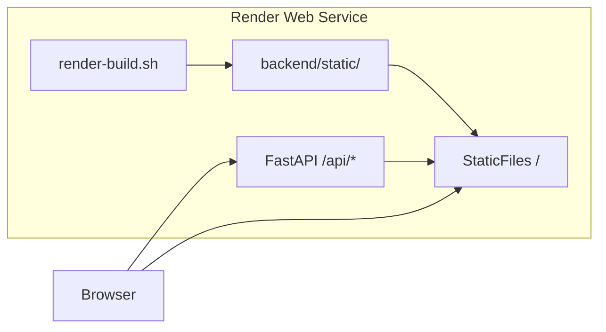

# Deploy on Render

This guide covers deploying the DNS Resolution Simulator to [Render](https://render.com) as a **single web service**. The FastAPI backend serves both the REST API and the built React UI from one URL, so the frontend can keep using relative `/api` paths with no cross-origin configuration.

## Architecture



| Component | Role |
|-----------|------|
| `render.yaml` | Blueprint: instance plan, build command, start command, env vars, health check |
| `scripts/render-build.sh` | Installs Python deps, builds frontend, copies `dist` → `backend/static` |
| `backend/runtime.txt` | Pins Python 3.12 for Render |
| `SERVE_STATIC=1` | Tells FastAPI to mount `backend/static` at `/` (production only) |

Local development is unchanged: run the API and Vite dev server separately (`make api` / `make web`). Static serving is disabled unless `SERVE_STATIC=1` is set.

## Prerequisites

- A [Render](https://render.com) account
- This repository pushed to GitHub, GitLab, or Bitbucket
- No database or external services — the app uses in-memory zone data

## Deploy with Blueprint (recommended)

1. Push your branch to the remote repository.
2. In the Render dashboard, click **New** → **Blueprint**.
3. Connect the repository. Render detects `render.yaml` at the repo root.
4. Review the proposed service (`dns-simulator`) and click **Apply**.

Render creates one **Web Service** with:

| Setting | Value |
|---------|-------|
| Instance plan | **Free** (`plan: free` in `render.yaml`) |
| Runtime | Python |
| Root directory | **Repo root** (empty — not `backend`) |
| Build command | `bash scripts/render-build.sh` |
| Start command | `cd backend && uvicorn app.main:app --host 0.0.0.0 --port $PORT` |
| Health check | `/api/health` |

> **Why repo root?** If root directory is `backend`, Render only redeploys when files under `backend/` change — frontend edits (React, CSS, `index.html`) would **not** trigger auto-deploy. The build script still installs Python deps and builds the frontend; the start command runs uvicorn from `backend/`.

After the first deploy succeeds, open the service URL (e.g. `https://dns-simulator.onrender.com`). The simulator UI loads at `/`; API docs are at `/docs`.

## Deploy manually (without Blueprint)

If you prefer to create the service by hand:

1. **New** → **Web Service** → connect your repo.
2. Set **Instance Type** to **Free**.
3. Leave **Root Directory** empty (repo root). Do **not** set it to `backend` only — that skips redeploys on frontend changes.
4. **Build Command:** `bash scripts/render-build.sh`
5. **Start Command:** `cd backend && uvicorn app.main:app --host 0.0.0.0 --port $PORT`
6. **Health Check Path:** `/api/health`
7. Add environment variables (see below).

## Environment variables

Set automatically by `render.yaml`:

| Variable | Value | Purpose |
|----------|-------|---------|
| `PYTHON_VERSION` | `3.12.0` | Python runtime for the web service |
| `NODE_VERSION` | `22` | Node.js used during the build to compile the frontend |
| `SERVE_STATIC` | `1` | Enable serving the React production bundle from FastAPI |

Optional:

| Variable | Example | Purpose |
|----------|---------|---------|
| `ALLOWED_ORIGINS` | `https://my-custom-domain.com` | Extra CORS origins (comma-separated). Not needed when UI and API share the same Render URL. |

Render injects `PORT` automatically; do not set it manually.

## Build pipeline

`scripts/render-build.sh` runs on every deploy:

1. `pip install -r backend/requirements.txt`
2. `npm install` and `npm run build` in `frontend/`
3. Replace `backend/static/` with the Vite `dist/` output

The `backend/static/` directory is gitignored; it exists only on the server after a successful build.

## Verify production locally

Simulate the Render build and runtime before pushing:

```bash
# From repo root
bash scripts/render-build.sh

cd backend
SERVE_STATIC=1 uvicorn app.main:app --port 8000
```

Open **http://localhost:8000** for the UI and **http://localhost:8000/docs** for the API. Health check: **http://localhost:8000/api/health**.

Backend tests still run without `SERVE_STATIC` (they expect JSON at `/`, not the HTML shell).

## Redeploys

Render redeploys automatically when you push to the connected branch. To redeploy without a code change, use **Manual Deploy** → **Deploy latest commit** in the service dashboard.

## Cost

Using a **Blueprint is free** — it is only Render’s infrastructure-as-code format. You pay for the resources it creates (if any).

This project’s `render.yaml` sets `plan: free`, so the web service runs on Render’s **$0/month Free instance**:

| Item | Cost |
|------|------|
| Blueprint (IaC) | $0 |
| Hobby workspace | $0 |
| Web service (`plan: free`) | $0/month |

Free-tier limits that matter for this app:

- **Cold starts** — spins down after ~15 minutes of inactivity; first request after sleep can take 30–60 seconds
- **512 MB RAM**, shared CPU
- **500 build pipeline minutes/month** on Hobby (each deploy consumes some)
- **5 GB outbound bandwidth/month** on the current Hobby plan

For an always-on demo with no cold starts, upgrade the instance to **Starter** (~$7/month) in the service settings or change `plan: free` to `plan: starter` in `render.yaml`.

## Troubleshooting

| Symptom | Likely cause | Fix |
|---------|--------------|-----|
| Build fails at `npm run build` | Node missing or wrong version | Confirm `NODE_VERSION=22` is set |
| Build fails at `pip install` | Python version mismatch | Confirm `PYTHON_VERSION=3.12.0` and `backend/runtime.txt` |
| UI shows JSON at `/` instead of the app | Static bundle not served | Set `SERVE_STATIC=1`; confirm build copied files to `backend/static` |
| UI loads but API calls fail | Wrong base URL or service not ready | Use same-origin `/api`; wait for cold start on free tier |
| Health check failing | Service crashed or wrong path | Check logs; path must be `/api/health` |

View build and runtime logs in the Render dashboard under your service → **Logs**.

## Related files

```
├── render.yaml              # Render Blueprint
├── scripts/render-build.sh  # Production build script
├── backend/
│   ├── runtime.txt          # Python version pin
│   ├── app/main.py          # Static mount when SERVE_STATIC=1
│   └── static/              # Generated at deploy (not in git)
└── frontend/                # Built during deploy
```

For local Docker-based runs, see the **Docker** section in [README.md](../README.md).
