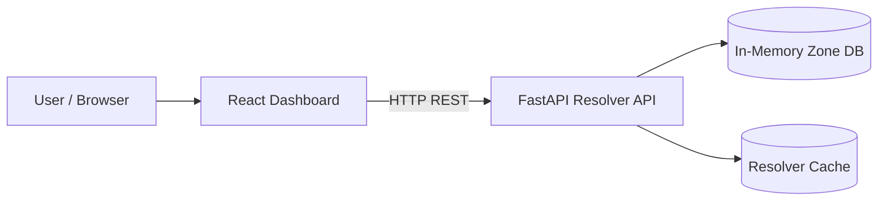
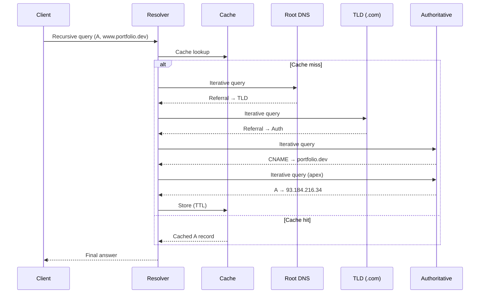
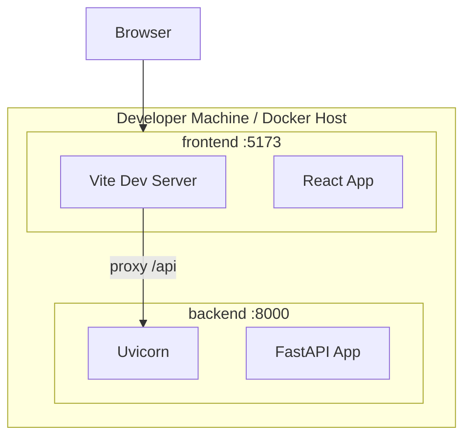

# High-Level Design (HLD)

## 1. Overview

The DNS Resolution Simulator models the **Application Layer DNS** stack described in standard networking curricula: users enter hostnames; the system resolves them through a **hierarchical, distributed** naming system with **caching** to reduce latency and load.

## 2. System context



## 3. DNS hierarchy (logical)

Aligned with reference material:

```
                    [ Root "." ]
                         |
           +-------------+-------------+
           |                           |
      [ TLD .com ]                [ TLD .org ]
           |                           |
    +------+------+              [ geeksforgeeks.org ]
    |             |
[ portfolio.dev ] [ example.com ]
    |
 [ www ] → CNAME → apex → A → IP
```

## 4. Resolution flow (happy path)

1. **User input** — Browser requests `www.portfolio.dev`
2. **Local cache** — Optional OS/browser cache (simulated via resolver cache)
3. **Recursive resolver** — Accepts query; performs full lookup on behalf of client
4. **Root** — Returns referral to `.com` TLD server
5. **TLD** — Returns referral to `portfolio.dev` authoritative NS
6. **Authoritative** — Returns CNAME, then A record after chain
7. **Response** — IP returned to client; optional connect to origin server node



## 5. Major components

| Component | Responsibility |
|-----------|----------------|
| **React Frontend** | Records browser, resolver tester, animated topology graph |
| **API Gateway (FastAPI)** | REST endpoints, CORS, OpenAPI |
| **Resolver Engine** | Orchestrates iterative lookups, CNAME chasing, step emission |
| **Zone Catalog** | Static authoritative data for demo domains |
| **Resolver Cache** | TTL-based in-memory cache for non-recursive hits |

## 6. Query types modeled

| Type | Behavior in simulator |
|------|------------------------|
| **Recursive** | Client → Resolver (resolver does all work) |
| **Iterative** | Resolver → Root/TLD/Auth (referrals or partial answers) |
| **Non-recursive** | Resolver → Cache (immediate answer if valid TTL) |

## 7. Data stores

| Store | Type | Content |
|-------|------|---------|
| Zone records | In-memory list | All DNS RRs for demo zones |
| Resolver cache | In-memory dict | Key: `name:type`, value + TTL |
| Topology | Static config | Nodes (servers) and edges (links) |

## 8. Deployment view



## 9. Cross-cutting concerns

- **Observability**: Each resolve returns `steps[]` for UI animation
- **Security**: Local-only demo; no authentication required
- **Extensibility**: New zones added in `backend/app/data/zones.py`

## 10. References

- GeeksforGeeks DNS article (hierarchy, caching, TTL, record types, reverse DNS)
- RFC 1034/1035 concepts (simplified for education)
